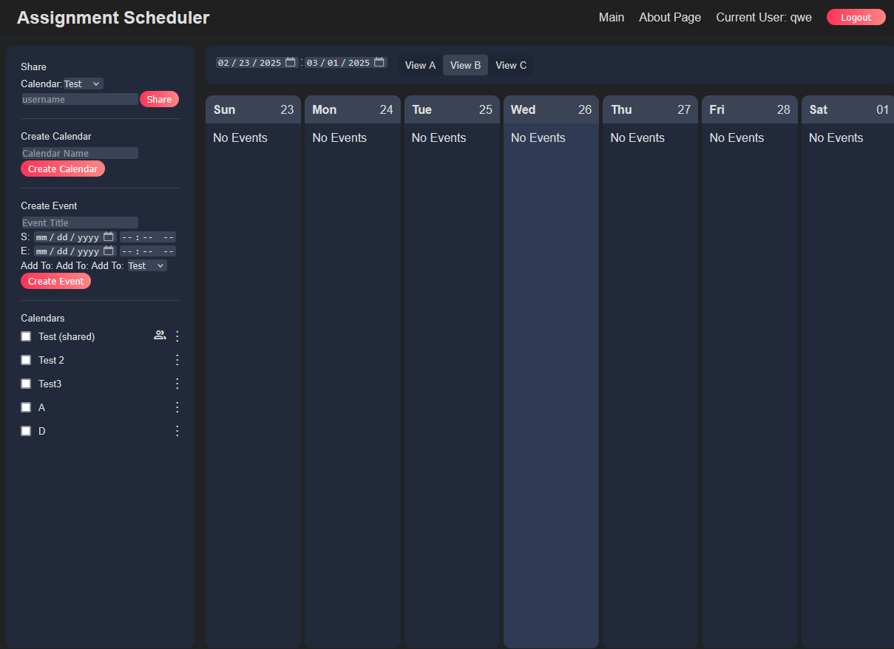

# AssignmentScheduler

## NOTICE
This project is under active development and has not yet reached a MVP. Many key features are missing, and or have placeholders at the momement.

## Key Features
* store and edit events, assignments, exams, and dates
* Various layouts to visualize deadlines, and events
* tracking time needed for completion of assignments to facilitate planning ahead
* sharing of events, dates, and deadlines with other users
* integration with ical and google cal feeds
* mobile and pc support formatting

